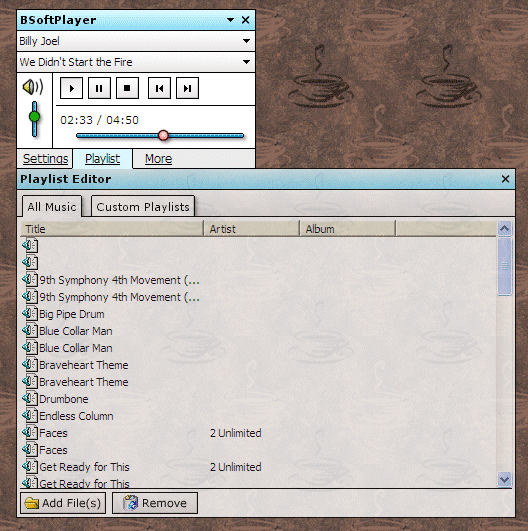

## BSoftPlayer MP3 / WMA Player \- Graphical audio player with ID3 support

### Description

Superceded by BSoftPlayer3. Search for "BSoftPlayer3" for details.
 
### More Info
 

             |
---                |---
**Submitted On**   |2002-01-11 17:15:44
**By**             |[Brian Cairns](https://github.com/Planet-Source-Code/PSCIndex/blob/master/ByAuthor/brian-cairns.md)
**Level**          |Intermediate
**User Rating**    |4.5 (50 globes from 11 users)
**Compatibility**  |VB 6\.0
**Category**       |[Sound/MP3](https://github.com/Planet-Source-Code/PSCIndex/blob/master/ByCategory/sound-mp3__1-45.md)
**World**          |[Visual Basic](https://github.com/Planet-Source-Code/PSCIndex/blob/master/ByWorld/visual-basic.md)
**Archive File**   |[BSoftPlaye481171122002\.zip](https://github.com/Planet-Source-Code/brian-cairns-bsoftplayer-mp3-wma-player-graphical-audio-player-with-id3-support__1-30677/archive/master.zip)

